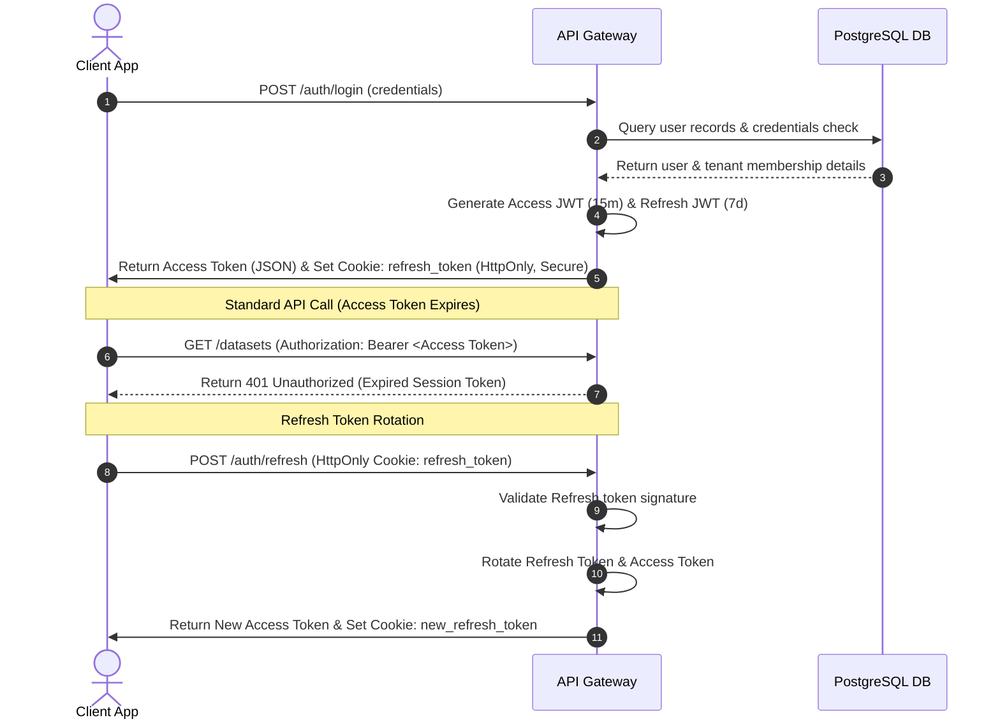

# DataSense AI - REST API Specification
## Version 1.0.0 (OpenAPI 3.1.0 Style)

---

## 1. Global API Conventions

### Base URL
All API requests must target the standard API gateway entrypoint prefix:
```text
/api/v1
```

### Versioning Strategy
API versioning is explicitly managed via URL path segments: `/api/v1/`. Backward-incompatible changes will trigger a version increment to `/api/v2/`.

### HTTP Status Code Standard
The API complies with standard HTTP protocol responses:
*   `200 OK` – Successful resource query or update.
*   `201 Created` – Successful resource creation.
*   `202 Accepted` – Long-running background task enqueued (returns `task_id`).
*   `400 Bad Request` – Client validation check failure.
*   `401 Unauthorized` – Bearer token signature check failed or expired.
*   `403 Forbidden` – Action blocked by RBAC policies or disabled feature flags.
*   `404 Not Found` – Target resource does not exist (or belongs to another tenant).
*   `422 Unprocessable Entity` – Request schema validation failure (e.g. Zod/Pydantic errors).
*   `429 Too Many Requests` – Rate limit threshold exceeded.
*   `500 Internal Server Error` – System exception, unhandled database locks.

---

## 2. Authentication & JWT Lifecycle

DataSense AI uses stateless JWT access tokens combined with secure HttpOnly refresh token rotation.



### Refresh Token Cookie Attributes
The `refresh_token` is set by the backend server using HTTP headers:
```text
Set-Cookie: refresh_token=<token>; Path=/api/v1/auth/refresh; HttpOnly; Secure; SameSite=Strict;
```

---

## 3. Global Response envelopes

### Success Envelope
```json
{
  "status": "success",
  "data": {}
}
```

### Error Envelope
```json
{
  "error_code": "RESOURCE_NOT_FOUND",
  "message": "The requested resource could not be found.",
  "correlation_id": "req-9a8b-7c6d5e4f",
  "timestamp": "2026-07-13T20:46:00Z",
  "details": {}
}
```

---

## 4. Query Parameter Standards

### Pagination Standard
Endpoints returning lists support pagination query options:
*   `page`: Integer (Default: `1`, minimum: `1`).
*   `page_size`: Integer (Default: `20`, maximum: `100`).

Pagination responses append a metadata node:
```json
{
  "status": "success",
  "data": [],
  "pagination": {
    "current_page": 1,
    "page_size": 20,
    "total_pages": 5,
    "total_count": 85
  }
}
```

### Filtering & Sorting Standard
*   **Sorting:** Checked using the `sort_by` (field name) and `sort_order` (`asc` or `desc`) query parameters.
*   **Filtering:** Checked using column keys as query options: `?filter_field=status&filter_value=COMPLETED`.

---

## 5. API Security Best Practices
1.  **Transport Protection:** TLS 1.3 is enforced on all gateway traffic. HTTP requests are redirected to HTTPS.
2.  **SaaS Tenant Boundary Isolation:** The API middleware validates access tokens, injecting `org_id` and `workspace_id` contexts into all backend scopes.
3.  **Command Validation:** Conversational BI queries pass through AST analyzers to prevent SQL injections or file access attempts.

---

## 6. API Endpoint Inventory

### Module 1: Authentication & SaaS Identity

#### Register User & Organization
*   **Method / URL:** `POST /auth/signup`
*   **Description:** Creates a new tenant organization and registers the primary administrative user account.
*   **Auth Required:** No
*   **Request Body Schema:**
    | Property | Type | Rules | Description |
    | :--- | :--- | :--- | :--- |
    | `email` | String | Email format | Primary user login email |
    | `password` | String | Min 8 chars, 1 uppercase, 1 digit | Security password |
    | `first_name` | String | Min 1 char | User first name |
    | `last_name` | String | Min 1 char | User last name |
    | `org_name` | String | Min 1 char | New tenant corporate name |
*   **Request Example:**
    ```json
    {
      "email": "owner@acme.com",
      "password": "SecurePassword123",
      "first_name": "Jane",
      "last_name": "Doe",
      "org_name": "Acme Corp"
    }
    ```
*   **Success Response (201 Created):**
    ```json
    {
      "status": "success",
      "data": {
        "user_id": "7ca34bfa-9ec8-4e12-87db-223405c754d9",
        "email": "owner@acme.com",
        "organization": {
          "id": "aa39f28-8b9a-41e9-9182-1209acbfda01",
          "name": "Acme Corp",
          "slug": "acme-corp"
        },
        "role": "ORG_OWNER"
      }
    }
    ```

#### User Login Authentication
*   **Method / URL:** `POST /auth/login`
*   **Description:** Authenticates user credentials and sets HttpOnly refresh cookies.
*   **Auth Required:** No
*   **Request Body Schema:**
    | Property | Type | Rules | Description |
    | :--- | :--- | :--- | :--- |
    | `email` | String | Email format | Login email |
    | `password` | String | Required | Login password |
    | `workspace_id` | UUID | Optional | Select target workspace immediately |
*   **Response (200 OK):**
    *   *Headers:* `Set-Cookie: refresh_token=<token>; HttpOnly; Secure; SameSite=Strict`
    *   *Body:*
        ```json
        {
          "status": "success",
          "data": {
            "access_token": "eyJhbGciOiJIUzI1NiIsIn...",
            "token_type": "bearer",
            "user": {
              "id": "7ca34bfa-9ec8-4e12-87db-223405c754d9",
              "email": "owner@acme.com",
              "org_role": "ORG_OWNER",
              "active_workspace_id": "0dfbc45c-201a-4be2-a3c3-d92ea40b49cb"
            }
          }
        }
        ```

#### User Logout
*   **Method / URL:** `POST /auth/logout`
*   **Description:** Invalidates session contexts and removes cookies.
*   **Auth Required:** Yes
*   **Response (200 OK):**
    ```json
    {
      "status": "success",
      "data": {
        "message": "Session invalidated successfully."
      }
    }
    ```

#### JWT Token Refresh
*   **Method / URL:** `POST /auth/refresh`
*   **Description:** Validates refresh cookies to rotate session access keys.
*   **Auth Required:** Yes (via cookie verification)
*   **Response (200 OK):**
    *   *Headers:* `Set-Cookie: refresh_token=<new_token>; HttpOnly; Secure; SameSite=Strict`
    *   *Body:*
        ```json
        {
          "status": "success",
          "data": {
            "access_token": "eyJhbGciOiJIUzI1NiIsIn..."
          }
        }
        ```

---

### Module 2: Organizations & Workspaces

#### Create Workspace
*   **Method / URL:** `POST /workspaces`
*   **Description:** Registers a new analytical workspace inside the active organization.
*   **Auth Required:** Yes
*   **Authz Required:** `ORG_ADMIN` or `ORG_OWNER`
*   **Request Body Schema:**
    | Property | Type | Rules | Description |
    | :--- | :--- | :--- | :--- |
    | `name` | String | Min 1 char | Target workspace display name |
    | `slug` | String | Alphanumeric, unique in org | URL namespace mapping |
*   **Response (201 Created):**
    ```json
    {
      "status": "success",
      "data": {
        "workspace_id": "0dfbc45c-201a-4be2-a3c3-d92ea40b49cb",
        "name": "Marketing Team",
        "slug": "marketing-team",
        "organization_id": "aa39f28-8b9a-41e9-9182-1209acbfda01"
      }
    }
    ```

#### Invite Members to Workspace
*   **Method / URL:** `POST /workspaces/{id}/members`
*   **Description:** Grants workspace membership and sets roles for a user.
*   **Path Parameters:** `id`: UUID (Workspace ID)
*   **Request Body Schema:**
    | Property | Type | Rules | Description |
    | :--- | :--- | :--- | :--- |
    | `email` | String | Email format | Invited user email |
    | `role` | String | `WS_ADMIN`, `WS_ANALYST`, `WS_VIEWER` | Assigned role |
*   **Response (200 OK):**
    ```json
    {
      "status": "success",
      "data": {
        "message": "User invited to workspace successfully.",
        "membership_id": "8bda29fb-ac01-447a-88fa-0129cf3201ab"
      }
    }
    ```

---

### Module 3: Users Profile & Settings

#### Retrieve User Profile
*   **Method / URL:** `GET /users/me`
*   **Description:** Gets current user info, organization settings, and permissions.
*   **Auth Required:** Yes
*   **Response (200 OK):**
    ```json
    {
      "status": "success",
      "data": {
        "user_id": "7ca34bfa-9ec8-4e12-87db-223405c754d9",
        "email": "user@datasense.ai",
        "first_name": "Jane",
        "last_name": "Doe",
        "org_role": "ORG_MEMBER",
        "active_workspace": {
          "id": "0dfbc45c-201a-4be2-a3c3-d92ea40b49cb",
          "role": "WS_ANALYST"
        }
      }
    }
    ```

---

### Module 4: Dataset Ingest & Management

#### Ingest Raw Dataset File
*   **Method / URL:** `POST /datasets/upload`
*   **Description:** Uploads a CSV, XLSX, or JSON file, validates it, and converts it to Parquet in the background.
*   **Auth Required:** Yes
*   **Authz Required:** `WS_ANALYST` or higher
*   **Request Headers:** `Content-Type: multipart/form-data`
*   **Request Body:**
    *   `file`: Binary File payload (max 500MB)
    *   `name`: String (Dataset label)
    *   `description`: String (Optional details)
*   **Response (202 Accepted):**
    ```json
    {
      "status": "success",
      "data": {
        "dataset_id": "8de5f392-80ba-4752-95f8-e9f0d8591a22",
        "status": "PROCESSING",
        "task_id": "celery-task-uuid-1111"
      }
    }
    ```

#### Retrieve Column Metadata Profiles
*   **Method / URL:** `GET /datasets/{id}/metadata`
*   **Description:** Returns data types, stats, quality metrics, and pgvector embeddings status for each column.
*   **Path Parameters:** `id`: UUID (Dataset ID)
*   **Response (200 OK):**
    ```json
    {
      "status": "success",
      "data": {
        "dataset_id": "8de5f392-80ba-4752-95f8-e9f0d8591a22",
        "total_rows": 25000,
        "data_quality_score": 94.20,
        "columns": [
          {
            "column_name": "net_revenue",
            "data_type": "float64",
            "inferred_type": "NUMERIC",
            "missing_count": 0,
            "duplicate_count": 0,
            "min_value": "12.50",
            "max_value": "45000.00",
            "mean_value": 340.50,
            "is_kpi": true,
            "kpi_type": "REVENUE"
          }
        ]
      }
    }
    ```

---

### Module 5: Data Cleaning Engine

#### Apply Cleaning Strategies
*   **Method / URL:** `POST /datasets/{id}/clean`
*   **Description:** Starts a background job to clean the dataset based on selected rules, saving the output as a new version.
*   **Path Parameters:** `id`: UUID
*   **Request Body Schema:**
    ```typescript
    const CleanRequest = z.object({
      actions: z.array(z.object({
        column: z.string(),
        strategy: z.enum(["DROP_DUPLICATES", "IMPUTE_MEAN", "IMPUTE_MEDIAN", "IMPUTE_CONSTANT", "DROP_ROWS_MISSING", "REMOVE_OUTLIERS"]),
        constant_value: z.string().optional()
      }))
    });
    ```
*   **Response (202 Accepted):**
    ```json
    {
      "status": "success",
      "data": {
        "dataset_id": "8de5f392-80ba-4752-95f8-e9f0d8591a22",
        "status": "PROCESSING",
        "task_id": "celery-task-uuid-2222"
      }
    }
    ```

---

### Module 6: Analytics & Health Scores

#### Get Business Health Score
*   **Method / URL:** `GET /analytics/health-score`
*   **Description:** Calculates the overall Business Health Score ($BHS$) and sub-metrics (Revenue, Churn, NPS) for a dataset.
*   **Query Parameters:** `dataset_id`: UUID
*   **Response (200 OK):**
    ```json
    {
      "status": "success",
      "data": {
        "dataset_id": "8de5f392-80ba-4752-95f8-e9f0d8591a22",
        "overall_score": 84.50,
        "metrics": {
          "revenue": 92.10,
          "profit": 88.40,
          "growth": 76.50,
          "customer_retention": 85.00,
          "conversion": 68.20,
          "inventory": 90.00,
          "customer_satisfaction": 88.00,
          "churn": 82.50,
          "forecast": 89.00
        },
        "calculated_at": "2026-07-14T22:30:00Z"
      }
    }
    ```

---

### Module 7: Auto Dashboards & Shares

#### Auto Generate Dashboard Layout
*   **Method / URL:** `POST /dashboards/auto-generate`
*   **Description:** Analyzes columns and metrics using heuristics, automatically generating the layout grid configurations.
*   **Request Body Schema:**
    | Property | Type | Rules | Description |
    | :--- | :--- | :--- | :--- |
    | `dataset_id` | UUID | Required | Target dataset |
*   **Response (201 Created):**
    ```json
    {
      "status": "success",
      "data": {
        "dashboard_id": "e0034a7d-8153-43bb-a5a4-129035aa83fa",
        "title": "Auto Analytics Dashboard",
        "active_version": 1,
        "layout_columns": 12,
        "cards": [
          {
            "id": "card-99b8",
            "title": "Total net_revenue",
            "card_type": "KPI_CARD",
            "config": {
              "aggregation": "SUM",
              "target_column": "net_revenue"
            },
            "position": { "x": 0, "y": 0, "w": 4, "h": 2 }
          }
        ]
      }
    }
    ```

#### Share Dashboard
*   **Method / URL:** `POST /dashboards/{id}/share`
*   **Description:** Generates a read-only share token for the dashboard.
*   **Path Parameters:** `id`: UUID
*   **Request Body Schema:**
    | Property | Type | Rules | Description |
    | :--- | :--- | :--- | :--- |
    | `expires_in_hours` | Integer | Optional | Expiration TTL |
*   **Response (200 OK):**
    ```json
    {
      "status": "success",
      "data": {
        "share_url": "https://datasense.ai/shared/dashboards/tok_33d82a1b9f",
        "expires_at": "2026-07-15T22:30:00Z"
      }
    }
    ```

---

### Module 8: Conversational BI

#### Send Message
*   **Method / URL:** `POST /conversations/chat`
*   **Description:** Submits a natural language query, runs RAG-based search and AST validation, queries DuckDB, and returns the analysis and ECharts options.
*   **Request Body Schema:**
    | Property | Type | Rules | Description |
    | :--- | :--- | :--- | :--- |
    | `conversation_id` | UUID | Optional | Append to active chat |
    | `dataset_id` | UUID | Required | Dataset reference |
    | `message` | String | Min 1 char | NL Question |
*   **Response (200 OK):**
    ```json
    {
      "status": "success",
      "data": {
        "conversation_id": "fa21c323-c90a-4712-ba61-ec23fa55490a",
        "message": {
          "role": "AI",
          "content": "Acme products generated the highest revenue, totaling $150,000.",
          "sql_query": "SELECT brand, SUM(revenue) FROM dataset_table GROUP BY brand LIMIT 1;",
          "visualization": {
            "type": "CHART",
            "chart_type": "BAR",
            "confidence_score": 0.94,
            "ai_explanation": "Recommended a bar chart to compare the revenue of each product brand.",
            "data": [
              { "brand": "Acme", "value": 150000 }
            ]
          }
        }
      }
    }
    ```

---

### Module 9: AI Insights

#### Get Executive Summary
*   **Method / URL:** `GET /insights/executive-summary`
*   **Description:** Summarizes trends and anomalies in the data using LLM-generated business narratives.
*   **Query Parameters:** `dataset_id`: UUID
*   **Response (200 OK):**
    ```json
    {
      "status": "success",
      "data": {
        "dataset_id": "8de5f392-80ba-4752-95f8-e9f0d8591a22",
        "summary": "Revenue grew 14% MoM, driven by a 22% increase in Electronics sales. Outliers detected in transactions indicate potential supply challenges in Region B.",
        "generated_at": "2026-07-14T22:30:00Z"
      }
    }
    ```

---

### Module 10: Predictive Analytics & SHAP

#### Train Predictive Model
*   **Method / URL:** `POST /predictions/train`
*   **Description:** Starts a background job to train an XGBoost or Prophet model on the dataset and compute SHAP feature importances.
*   **Request Body Schema:**
    | Property | Type | Rules | Description |
    | :--- | :--- | :--- | :--- |
    | `dataset_id` | UUID | Required | Training dataset |
    | `task_type` | String | `FORECAST_TIME_SERIES`, `CHURN_CLASSIFICATION` | Target ML task |
    | `target_column` | String | Required | Target target column |
*   **Response (202 Accepted):**
    ```json
    {
      "status": "success",
      "data": {
        "model_id": "bfd992a0-47bf-463f-9de9-cc8dcf2b992f",
        "status": "TRAINING",
        "task_id": "celery-task-uuid-3333"
      }
    }
    ```

#### Get SHAP Explanations
*   **Method / URL:** `GET /predictions/models/{id}/explain`
*   **Description:** Returns global feature importance parameters and SHAP values for the model.
*   **Path Parameters:** `id`: UUID (Model ID)
*   **Response (200 OK):**
    ```json
    {
      "status": "success",
      "data": {
        "model_id": "bfd992a0-47bf-463f-9de9-cc8dcf2b992f",
        "base_value": 0.245,
        "global_feature_importance": [
          { "feature": "tenure", "importance": 0.42 },
          { "feature": "monthly_charges", "importance": 0.28 }
        ],
        "shap_summary_plot_url": "https://minio/models/bfd992a0/shap_summary.png"
      }
    }
    ```

---

### Module 11: Business Reports Module

#### Export Report
*   **Method / URL:** `POST /reports/export`
*   **Description:** Starts a background job to export the dashboard as a PDF, Excel sheet, or CSV.
*   **Request Body Schema:**
    | Property | Type | Rules | Description |
    | :--- | :--- | :--- | :--- |
    | `dashboard_id` | UUID | Required | Dashboard source |
    | `format` | String | `PDF`, `EXCEL`, `CSV` | Output format |
*   **Response (202 Accepted):**
    ```json
    {
      "status": "success",
      "data": {
        "report_id": "aa39f28-8b9a-41e9-9182-1209acbfda01",
        "status": "PROCESSING",
        "task_id": "celery-task-uuid-4444"
      }
    }
    ```

---

### Module 12: Feature Flags Admin Module

#### List Feature Flags
*   **Method / URL:** `GET /admin/feature-flags`
*   **Description:** Returns all configured feature flags.
*   **Auth Required:** Yes
*   **Authz Required:** System `ADMIN`
*   **Response (200 OK):**
    ```json
    {
      "status": "success",
      "data": [
        {
          "id": "31ad99b-4e02-47ba-89a3-cbb827f8a901",
          "name": "CONVERSATIONAL_BI",
          "is_enabled": true,
          "rollout_percentage": 100
        }
      ]
    }
    ```

---

### Module 13: Enterprise Audit Logs

#### Query Audit Logs
*   **Method / URL:** `GET /admin/audit-logs`
*   **Description:** Returns filtered audit logs for the organization.
*   **Auth Required:** Yes
*   **Authz Required:** `ORG_ADMIN` or `ORG_OWNER`
*   **Query Parameters:**
    *   `action`: String (Optional filter)
    *   `user_id`: UUID (Optional filter)
    *   `page`: Integer (Default: 1)
*   **Response (200 OK):**
    ```json
    {
      "status": "success",
      "data": [
        {
          "id": "f5b28ea-8cf1-45a8-ba81-1203aa45dbf2",
          "user_id": "7ca34bfa-9ec8-4e12-87db-223405c754d9",
          "action": "SQL_EXECUTION",
          "resource_type": "DATASET",
          "created_at": "2026-07-14T22:30:00Z"
        }
      ],
      "pagination": {
        "current_page": 1,
        "page_size": 20,
        "total_count": 120
      }
    }
    ```
