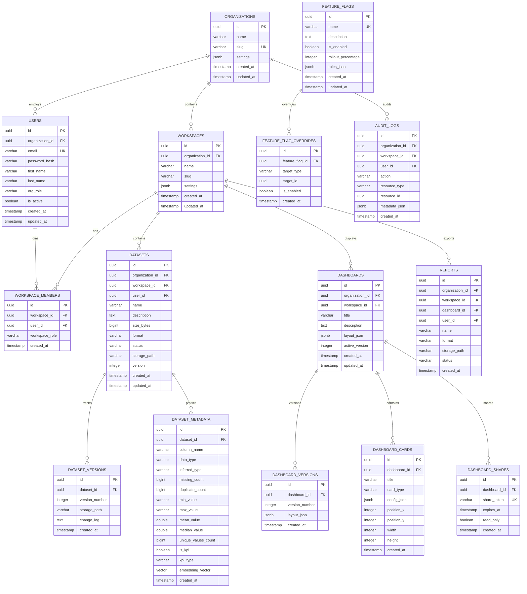

# DataSense AI - Database Schema Manual
## PostgreSQL + pgvector Schema Specification

---

## 1. Entity Relationship (ER) Diagram

The following Mermaid diagram shows the relational schema, constraints, and links of the multi-tenant SaaS database.



---

## 2. Table Specifications

### Table: `organizations`
*   **Purpose:** SaaS customer organization profiles.
*   **Columns:**
    *   `id` (UUID, Primary Key, Default: `uuid_generate_v4()`)
    *   `name` (VARCHAR(255), Not Null) – Organization legal name.
    *   `slug` (VARCHAR(255), Not Null, Unique) – URL identifier slug.
    *   `settings` (JSONB, Not Null, Default: `'{}'::jsonb`) – Config parameters.
    *   `created_at` (TIMESTAMPTZ, Default: `CURRENT_TIMESTAMP`)
    *   `updated_at` (TIMESTAMPTZ, Default: `CURRENT_TIMESTAMP`)

### Table: `workspaces`
*   **Purpose:** Workspace boundaries within an organization.
*   **Columns:**
    *   `id` (UUID, Primary Key)
    *   `organization_id` (UUID, Not Null, FK: `organizations.id` ON DELETE CASCADE)
    *   `name` (VARCHAR(255), Not Null)
    *   `slug` (VARCHAR(255), Not Null)
    *   `settings` (JSONB, Default: `'{}'::jsonb`)
    *   `created_at` (TIMESTAMPTZ)
    *   `updated_at` (TIMESTAMPTZ)
*   **Constraints:** `UNIQUE(organization_id, slug)`.

### Table: `users`
*   **Purpose:** Registered system users.
*   **Columns:**
    *   `id` (UUID, Primary Key)
    *   `organization_id` (UUID, Nullable, FK: `organizations.id` ON DELETE SET NULL)
    *   `email` (VARCHAR(255), Not Null, Unique)
    *   `password_hash` (VARCHAR(255), Not Null)
    *   `first_name` (VARCHAR(100), Not Null)
    *   `last_name` (VARCHAR(100), Not Null)
    *   `org_role` (VARCHAR(50), Default: `'ORG_MEMBER'`) – ORG_OWNER, ORG_ADMIN, ORG_MEMBER.
    *   `is_active` (BOOLEAN, Default: `TRUE`)

### Table: `workspace_members`
*   **Purpose:** Links users to workspaces with specific roles.
*   **Columns:**
    *   `id` (UUID, Primary Key)
    *   `workspace_id` (UUID, Not Null, FK: `workspaces.id` ON DELETE CASCADE)
    *   `user_id` (UUID, Not Null, FK: `users.id` ON DELETE CASCADE)
    *   `workspace_role` (VARCHAR(50), Default: `'WS_VIEWER'`) – WS_ADMIN, WS_ANALYST, WS_VIEWER.
*   **Constraints:** `UNIQUE(workspace_id, user_id)`.

### Table: `datasets`
*   **Purpose:** Ingested raw datasets metadata.
*   **Columns:**
    *   `id` (UUID, Primary Key)
    *   `organization_id` (UUID, Not Null, FK: `organizations.id` ON DELETE CASCADE)
    *   `workspace_id` (UUID, Not Null, FK: `workspaces.id` ON DELETE CASCADE)
    *   `user_id` (UUID, FK: `users.id` ON DELETE SET NULL)
    *   `name` (VARCHAR(255), Not Null)
    *   `description` (TEXT)
    *   `size_bytes` (BIGINT, Not Null)
    *   `format` (VARCHAR(10), Not Null) – CSV, XLSX, JSON.
    *   `status` (VARCHAR(50), Default: `'UPLOADING'`) – UPLOADING, PROCESSING, COMPLETED, FAILED.
    *   `storage_path` (VARCHAR(512), Not Null)

### Table: `dataset_metadata`
*   **Purpose:** Column-level profile statistics and RAG vector maps.
*   **Columns:**
    *   `id` (UUID, Primary Key)
    *   `dataset_id` (UUID, Not Null, FK: `datasets.id` ON DELETE CASCADE)
    *   `column_name` (VARCHAR(255), Not Null)
    *   `data_type` (VARCHAR(100), Not Null)
    *   `inferred_type` (VARCHAR(50), Not Null) – NUMERIC, CATEGORICAL, DATETIME, TEXT, BOOLEAN.
    *   `missing_count` (BIGINT, Default: 0)
    *   `duplicate_count` (BIGINT, Default: 0)
    *   `min_value` (VARCHAR(255))
    *   `max_value` (VARCHAR(255))
    *   `mean_value` (DOUBLE PRECISION)
    *   `median_value` (DOUBLE PRECISION)
    *   `unique_values_count` (BIGINT, Not Null)
    *   `is_kpi` (BOOLEAN, Default: `FALSE`)
    *   `kpi_type` (VARCHAR(50), Default: `'NONE'`)
    *   `embedding_vector` (vector(384)) – Cosine vector of description.
*   **Constraints:** `UNIQUE(dataset_id, column_name)`.

### Table: `audit_logs` (Monthly Partitioned Table)
*   **Purpose:** Records auditable actions for tenant compliance.
*   **Columns:**
    *   `id` (UUID, PK) – Managed per partition.
    *   `organization_id` (UUID, Not Null, FK: `organizations.id` ON DELETE CASCADE)
    *   `workspace_id` (UUID, FK: `workspaces.id` ON DELETE SET NULL)
    *   `user_id` (UUID, FK: `users.id` ON DELETE SET NULL)
    *   `action` (VARCHAR(100), Not Null) – USER_LOGIN, SQL_EXECUTION, DATASET_DELETE, etc.
    *   `resource_type` (VARCHAR(100), Not Null)
    *   `resource_id` (UUID)
    *   `metadata_json` (JSONB, Not Null, Default: `'{}'::jsonb`)
    *   `created_at` (TIMESTAMPTZ, Default: `CURRENT_TIMESTAMP`)
*   **Partition Strategy:** Range partitioned monthly on `created_at`.

---

## 3. Database Management & Index Tuning

### pgvector Indexing
To support semantic column search in Conversational BI, a Hierarchical Navigable Small World (HNSW) index is created on the `embedding_vector` column:
```sql
CREATE INDEX idx_metadata_embeddings ON dataset_metadata USING hnsw (embedding_vector vector_cosine_ops);
```

### Multi-Tenant Isolation Indexes
Every lookup in workspaces relies on the tenant composite scope:
```sql
CREATE INDEX idx_datasets_tenant_isolation ON datasets(organization_id, workspace_id);
CREATE INDEX idx_dashboards_tenant_isolation ON dashboards(organization_id, workspace_id);
```

### Database Maintenance & Connection Pooling
*   **Vacuum Strategy:** Autovacuum is configured to run after changes on 10% of rows to keep tables clean.
*   **Connection Pool:** FastAPI backend uses `SQLAlchemy` pooled engines targeting max connection bounds (`pool_size=30`, `max_overflow=15`, `pool_recycle=1800`).

---

## 4. Multi-Tenant Storage Isolation Strategy (DuckDB + Parquet)
1.  **Postgres Relational Meta:** Transactional metadata, user accounts, and layout parameters are stored in PostgreSQL.
2.  **Parquet Analytical Store:** Ingested datasets are saved as Parquet formats inside MinIO:
    ```text
    s3://datasense-analytics/organizations/{org_id}/workspaces/{workspace_id}/datasets/{dataset_id}/data.parquet
    ```
3.  **Local Worker Cache:** Parquet files are cached locally on NVMe mounts for fast analytical querying.
4.  **DuckDB Sandbox:** Analytical queries run inside sandboxed DuckDB instances. DuckDB connections are configured read-only, and memory limits are capped:
    ```sql
    SET memory_limit = '2GB';
    SET threads = 4;
    ```
