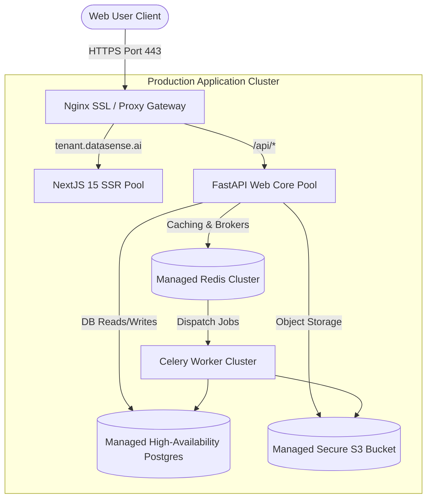

# DataSense AI - Systems Deployment Manual
## Infrastructure, Containers & DevOps Pipelines

---

## 1. Local Development Quickstart

### Prerequisites
*   Host OS: Linux, macOS, or Windows 11 with WSL2 enabled.
*   System Runtimes: **Python 3.13+**, **Node.js 22.x+**, **Docker Engine 24+**.

### Booting Local Containers Stack
From the workspace root directory:
```bash
docker-compose up --build
```
This launches:
*   `Nginx` proxy gateway listening on port `80`.
*   `Next.js 15` client listening on port `3000`.
*   `FastAPI` app listening on port `8000`.
*   `PostgreSQL` engine listening on port `5432`.
*   `Redis` cache listening on port `6379`.
*   `MinIO` storage listening on ports `9000` (API) and `9001` (console).

### Database Migrations Setup
Run Alembic migrations inside the active backend container:
```bash
docker-compose exec backend alembic upgrade head
```

---

## 2. Docker Architecture

### Backend Dockerfile (`infrastructure/docker/backend.Dockerfile`)
```dockerfile
FROM python:3.13-slim
WORKDIR /app
RUN apt-get update && apt-get install -y --no-install-recommends \
    build-essential libpq-dev gcc && rm -rf /var/lib/apt/lists/*
COPY backend/requirements.txt .
RUN pip install --no-cache-dir -r requirements.txt
COPY backend/src /app/src
COPY backend/alembic /app/alembic
COPY backend/alembic.ini /app/alembic.ini
COPY backend/.env /app/.env
EXPOSE 8000
CMD ["uvicorn", "src.app:app", "--host", "0.0.0.0", "--port", "8000"]
```

### Frontend Dockerfile (`infrastructure/docker/frontend.Dockerfile`)
```dockerfile
FROM node:22-alpine AS builder
WORKDIR /app
COPY frontend/package.json ./
RUN npm install
COPY frontend/src ./src
COPY frontend/public ./public
COPY frontend/postcss.config.js ./
COPY frontend/tailwind.config.js ./
COPY frontend/tsconfig.json ./
COPY frontend/next.config.js ./
COPY frontend/.env.local ./
RUN npm run build

FROM node:22-alpine AS runner
WORKDIR /app
ENV NODE_ENV=production
ENV PORT=3000
COPY --from=builder /app/.next/standalone ./
COPY --from=builder /app/.next/static ./.next/static
COPY --from=builder /app/public ./public
EXPOSE 3000
CMD ["node", "server.js"]
```

---

## 3. Production Deployment Guide

In a production environment, database, caching, and storage instances are managed as external cloud services to ensure high availability. Nginx acts as the entrypoint proxy, terminating SSL and routing subdomain requests.



### Nginx Configuration File (`infrastructure/docker/nginx.conf`)
```nginx
user nginx;
worker_processes auto;
pid /var/run/nginx.pid;

events {
    worker_connections 1024;
}

http {
    include /etc/nginx/mime.types;
    sendfile on;

    upstream api_server {
        server backend:8000;
    }

    upstream frontend_server {
        server frontend:3000;
    }

    server {
        listen 80;
        server_name localhost *.datasense.ai;
        return 301 https://$host$request_uri;
    }

    server {
        listen 443 ssl;
        server_name localhost *.datasense.ai;

        ssl_certificate /etc/letsencrypt/live/datasense.ai/fullchain.pem;
        ssl_certificate_key /etc/letsencrypt/live/datasense.ai/privkey.pem;
        ssl_protocols TLSv1.2 TLSv1.3;

        location /api/ {
            proxy_pass http://api_server;
            proxy_set_header Host $host;
            proxy_set_header X-Real-IP $remote_addr;
        }

        location / {
            proxy_pass http://frontend_server;
            proxy_set_header Host $host;
        }
    }
}
```

---

## 4. GitHub Actions CI/CD Pipeline

Create `.github/workflows/deploy.yml`:
```yaml
name: DataSense AI Production CI/CD

on:
  push:
    branches: [ main ]

jobs:
  lint-and-test:
    runs-on: ubuntu-latest
    steps:
      - uses: actions/checkout@v3
      
      - name: Set up Python 3.13
        uses: actions/setup-python@v4
        with:
          python-version: '3.13'
          
      - name: Install Backend Packages
        run: |
          cd backend
          pip install -r requirements.txt
          
      - name: Run Backend Tests
        run: |
          cd backend
          pytest

  build-and-deploy:
    needs: lint-and-test
    runs-on: ubuntu-latest
    steps:
      - uses: actions/checkout@v3
      
      - name: Log in to Docker Registry
        uses: docker/login-action@v2
        with:
          username: ${{ secrets.DOCKER_USERNAME }}
          password: ${{ secrets.DOCKER_PASSWORD }}
          
      - name: Build & Push Images
        run: |
          docker build -t datasense/backend:latest -f infrastructure/docker/backend.Dockerfile .
          docker build -t datasense/frontend:latest -f infrastructure/docker/frontend.Dockerfile .
          docker push datasense/backend:latest
          docker push datasense/frontend:latest

      - name: Deploy to Host Server
        uses: appleboy/ssh-action@master
        with:
          host: ${{ secrets.PROD_HOST }}
          username: ${{ secrets.PROD_USER }}
          key: ${{ secrets.SSH_KEY }}
          script: |
            cd /opt/datasense
            docker-compose pull
            docker-compose exec -T backend alembic upgrade head
            docker-compose up -d --no-deps backend frontend nginx
```

---

## 5. Telemetry & Observability Setup

DataSense AI uses Prometheus to collect metrics, Grafana for dashboard visualizations, and OpenTelemetry to trace requests.

### OpenTelemetry Collector Config (`prometheus.yml`):
```yaml
global:
  scrape_interval: 15s

scrape_configs:
  - job_name: 'fastapi'
    metrics_path: '/metrics'
    static_configs:
      - targets: ['backend:8000']
  - job_name: 'celery'
    static_configs:
      - targets: ['celery_worker:8000']
```

*   **Sentry Logging:** Integrated into the FastAPI app to capture traceback errors.
*   **Grafana Dashboards:** Configured to monitor API response latency, database connection pool utilization, CPU usage, and memory consumption.
